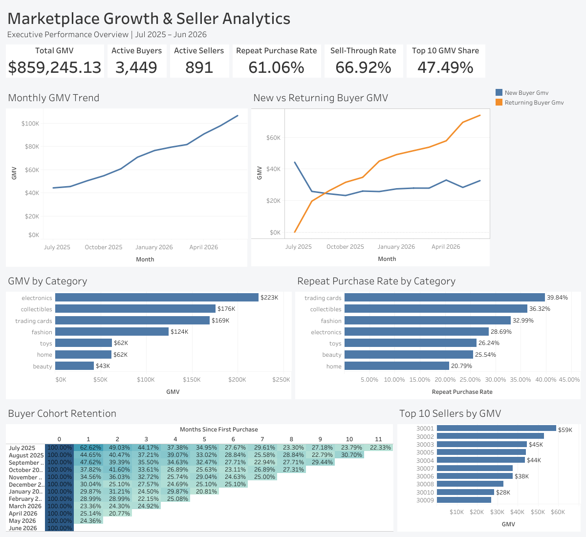

# Marketplace Growth & Seller Analytics

An end-to-end marketplace analytics project focused on growth, buyer retention, seller performance, and marketplace risk.

This project analyzes a simulated two-sided marketplace from July 2025 through June 2026 using BigQuery SQL, Python, and Tableau. The goal was to go beyond topline growth and evaluate whether the marketplace was growing in a healthy and sustainable way.

## Executive Summary

This project looks at how a simulated two-sided marketplace performed from July 2025 through June 2026, with a focus on growth, buyer behavior, seller performance, retention, and marketplace risk.

Over the year, monthly GMV grew from about $44K to more than $106K, an increase of roughly 141%. A growing share of that revenue came from returning buyers, which suggests the marketplace was building a more established customer base.

At the same time, the analysis uncovered two areas that could become problems if they are not addressed. Newer buyer cohorts were much less likely to return after their first month, and nearly half of total GMV came from just 10 sellers.

Overall, the marketplace is growing quickly, but the next stage of growth should focus less on simply bringing in more users and more on improving early buyer retention and building a broader base of successful sellers.

## Dashboard

